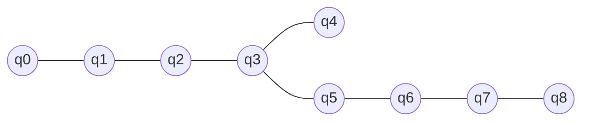

# GHZ Circuit Optimization

A Qiskit-based project for studying **9-qubit GHZ state generation** through different quantum circuit topologies.

## Current Work

* Implemented a 9-qubit GHZ circuit using Qiskit.
* Exploring different CNOT connection topologies for GHZ-state preparation.
* Representing the circuit topology as a graph.
* Studying the relationship between **topology, gate count, and circuit depth**.
* Visualizing the topology and quantum circuit structure.
* Exploring circuit optimization and transpilation as the next stage.

## 9-Qubit Topology

The current circuit is based on a graph representation where qubits are treated as nodes and CNOT interactions as edges.



The topology is used to study how different qubit-to-qubit connections affect GHZ-state construction.

## GHZ State

The target 9-qubit GHZ state is:

```text
|GHZ₉⟩ = (|000000000⟩ + |111111111⟩) / √2
```
## Next Steps

* Generalize the topology-based GHZ generator to arbitrary numbers of qubits.
* Compare multiple topologies automatically.
* Compare circuit depth and CNOT count.
* Investigate optimization after topology generation.
* Study hardware-aware transpilation separately.

## Tech Stack

**Python · Qiskit · NetworkX · Matplotlib**

## Author

Shirsha Nag
